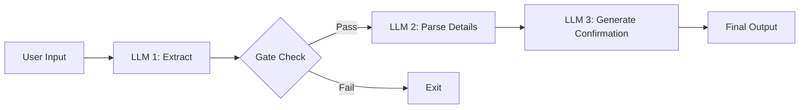

# Bitstream-Vera-Sans-Mono

```mermaid
graph LR
    A[User Input] --> B[LLM 1: Extract]
    B --> C{Gate Check}
    C -->|Pass| D[LLM 2: Parse Details]
    C -->|Fail| E[Exit]
    D --> F[LLM 3: Generate Confirmation]
    F --> G[Final Output]
```
